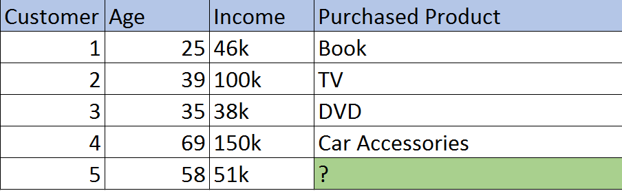

# Machine Learning with Java - Part 3 (k-Nearest Neighbor)

In my previous articles, we have discussed about the [linear](https://tech.io/playgrounds/3771/machine-learning-with-java---part-1-linear-regression) and [logistic](https://tech.io/playgrounds/34a7ecd0a4487577f516d92548af66891284/machine-learning-with-java---part-2-logistic-regression) regressions. This article focuses on the k nearest neighbor algorithm with java.

# Nearest Neighbor

Nearest Neighbor is also called as Instance-based Learning or Collaborative Filtering. It is a useful data mining technique, which allow us to use our past data with known output values to predict an output value for the new incoming data. 

# Difference with Regression and Classification

Let us consider Flipkart and the scenario that "the customer who purchased the product X also purchased the product Y". If we use classification algorithm for data mining , we will end up in infinite no of branches and nodes. The tree will be too big and also we cannot determine the accuracy too. Even if we have single branch, we will end up in only 3 products. But Flipkart will show us 10-12 products in recommendation section.

Nearest neighbor will fix the above problem in a very efficient manner. It’s not limited to any number of comparisons. It's as scalable for a 10-customer database as it is for a 10 million-customer database, and we can define the number of results that we wants to find. It will be the most useful for anyone reading this who has an e-commerce store.

# Concept with Nearest Neighbor

We have a customer data below to predict the output for the unknown data. In this case, we are going to find the recommendations for the customer with the input data age and income. The goal is to find what are all recommendations, we can give for the customer who is of 58 year and with monthly salary as 51k.

      

We must calculate the distance first and then based on the k value, we can give them nearest k neighbors.
The formula will be SQRT ((((input income age - Age)/ (highest age-lowest age)) ^2) + ((input income data - Income)/ (highest income -lowest income)) ^2)

By default, the k value is 1, we can pass the value of k while creating the instance. If the value of k is 1, it will display 1 product (1 nearest neighbor) and if the value of k is 2, it will display the 2 products. Using the above example, if we want to know the two most likely products to be purchased by Customer No. 5, we may conclude that they are books and a DVD based on the formula.

# Lazy Learning and Eager Learning

K-nearest neighbors is a lazy learning algorithm. KNN is a typical example of a lazy learner. It is called lazy not because of its apparent simplicity, but because it doesn't learn a discriminative function from the training data but memorizes the training dataset instead.

Eager Learning is opposite to Lazy Learning, in which the system tries to construct a general, input-independent target function during training of the system, where generalization beyond the training data is delayed until a query is made to the system. The last 2 articles we have seen is of eager learning type.

# Sample Example

@[Demo on KNN ?]({"stubs": ["src/main/java/com/gg/ml/KNNDemo.java"], "command": "com.gg.ml.KNNDemoTest#test"})

# Code Explanation

In code, we can pass the K value while creating the IBk instance. The IBk instance has an argument of type int. If we pass 1, it will calculate to find 1 nearest neighbor and if it is 2, it will try to find 2 nearest neighbor and so on.

If we don’t pass any argument and calling the default constructor will work for 1 nearest neighbor.

# Challenges with Nearest Neighbor model 

The power of Nearest Neighbor will be efficient with large amount of data like Flipkart with 10 billion customers, since they are likely many potential customers in their database with similar habits like the predicting customer.

The model breaks down quickly and become inaccurate when we have only few data points for the compariosion. The product recommendations will not be accurate in this case.

The one more challenge is, In Flipkart 10 million users, each customer must be calculated against the other 10 million customers to find the nearest neighbor. First, if our business has 10 million customers, that's not technically a problem. Second, these types of computations are ideal for the cloud in that they can offloaded to dozens of computers to be run simultaneously, with a final comparison done at the end. (Map Reduce) Third, in practice, it wouldn't be necessary to compare every customer in Flipkart's database to myself if I'm only purchasing a book. The assumption can be made that I can be compared to only other book buyers to find the best match, narrowing the potential neighbors to a fraction of the entire database.

Note: The data used here is just for an example, it is not a real one. 
The example demo also to just showcase how to use the algorithm.

